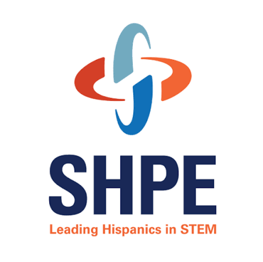

# Jaiden Medina

  B.S. in Computer Engineering @ Indiana University Bloomington  
  Accelerated M.S. in Intelligent Systems Engineering @ Indiana University | Starting Fall 2026  
  Minors in Mathematics and Intelligent Systems Engineering

  
  
  
  

---

## About Me

I'm a Computer Engineering student at Indiana University and incoming M.S. student in Intelligent Systems Engineering.

My work spans embedded systems, FPGA acceleration, machine learning, robotics, cloud services, and healthcare technology. I enjoy building intelligent systems that bridge hardware and software to solve real-world problems.

Inspired by my sister's experience with Type 1 diabetes, I'm especially interested in medical devices, digital health, and human-centered engineering.

🌐 **Portfolio:** [www.jaidenmedina.com](http://www.jaidenmedina.com)

---

## Current Focus

* Embedded Systems & Edge Computing
* FPGA Design & Hardware Acceleration
* Machine Learning & Intelligent Systems
* Medical Devices & Healthcare Technology
* Robotics & Autonomous Systems

---

## Featured Projects

### [Glucose Trend Alert System](https://github.com/jfmedina05/glucose-trend-alert-system)

A synthetic continuous glucose monitor analytics platform that simulates CGM workflows, detects glucose trends, classifies risk zones, and generates user-centered alerts.

**Highlights**

* Synthetic CGM data generation and trend analysis
* Risk classification and alert prioritization
* Streamlit dashboard for visualization
* Requirements traceability and validation documentation inspired by medical-device software practices

---

### [FPGA Digital Design & Hardware Acceleration](https://github.com/jfmedina05/fpga-digital-design-accelerators)

A collection of FPGA-based hardware accelerators built using SystemVerilog, AXI interfaces, and DMA-based data movement.

**Highlights**

* Hardware accelerator development
* AXI and DMA integration
* Custom C driver development
* Up to **250× speedup** over software implementations

---

### [Romi Autonomous Vehicle](https://github.com/jfmedina05/romi-autonomous-vehicle)

A distributed robotics platform combining a Romi 32U4 robot, Raspberry Pi, onboard vision system, and laptop operator station.

**Highlights**

* PID line following and encoder feedback control
* OpenCV and Redis drive-by-video system
* ArUco marker detection and autonomous behaviors
* Custom Fusion 360 camera mount design

---

### [STM32 Embedded Systems Project](https://github.com/jfmedina05/stm32-embedded-systems-project)

A collection of embedded systems projects involving firmware development, PCB integration, enclosure design, and power analysis.

**Highlights**

* UART communication and GPIO control
* STM32 HAL and STM32CubeIDE development
* Protective enclosure and sensor integration
* Power consumption and cost analysis

---

### [Bone Fracture Detection CNN](https://github.com/jfmedina05/bone-fracture-detection-cnn)

A healthcare-focused computer vision project using convolutional neural networks to classify bone fracture images.

**Highlights**

* TensorFlow/Keras model development
* Image preprocessing and augmentation
* Medical imaging classification workflow
* Training and validation performance analysis

---

### [ML Energy Load Microservice](https://github.com/jfmedina05/ml-energy-load-microservice)

A cloud-deployed machine learning microservice for predicting building heating and cooling loads.

**Highlights**

* Random Forest regression modeling
* Flask REST API development
* Swagger/OpenAPI documentation
* Jetstream2 cloud deployment

---

## Technical Areas

### Languages

Python • C • C++ • Java • SQL • SystemVerilog • Verilog • JavaScript • HTML/CSS • RISC-V Assembly

### Embedded & Hardware

STM32 • Raspberry Pi • Arduino • FPGA • UART • SPI • I2C • MQTT • GPIO • PWM

### Machine Learning & Data

TensorFlow • TensorFlow Lite • scikit-learn • Pandas • NumPy • OpenCV • Power BI

### Software & Cloud

Flask • REST APIs • Swagger/OpenAPI • GitHub Actions • Linux • Redis • Jetstream2

### Engineering Tools

Vivado • STM32CubeIDE • LTspice • AutoCAD • DraftSight • Fusion 360 • Git

---

## Language Breakdown

  <b>Overall</b>

  

  <b>Without C</b>

  

---

## Community & Leadership

  
  

### SHPE at Indiana University
Founder and President of the Indiana University chapter of the Society of Hispanic Professional Engineers (SHPE). Built a chapter serving 500+ students through professional development, industry partnerships, mentorship, and STEM outreach initiatives.

### Tau Epsilon Kappa (TEK)
Founding Class and Vice President of Technical Development of the Beta Chapter of Tau Epsilon Kappa, a professional engineering and business fraternity focused on leadership, technical growth, entrepreneurship, and career development.

---

## Activity Graph

  

---

## Beyond Engineering

Outside of engineering, I compete as a student-athlete on the Indiana University Men's Rugby Team and enjoy building projects that combine technology with real-world impact.

I'm passionate about creating systems that improve lives, whether through healthcare technology, embedded systems, robotics, or intelligent software.
